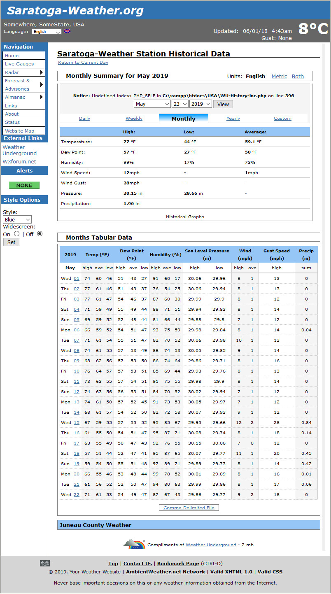

# WU-History - display PWS historical data from WeatherUnderground.com

## Background

This script set was originated by Jim McMurray (https://www.jcweather.us/) for his WeatherUnderground History page.  My thanks to Jim
for letting the script set be adapted for the [Saratoga Template](https://saratoga-weather.org/wxtemplates/) set.  The data for the
page originates with WeatherUnderground.com and was retrieved using a query to _WXDailyHistory.asp_ to return a CSV formatted file
with the WUID's station data.

**In May, 2019, WeatherUnderground intermittently discontinued the _WXDailyHistory.asp_ page operation, rendering this original script set non-functional.**

I've written a _WXDailyHistory.php_ page to use the WU/TWC API to api.weather.com requests for JSON data, and return the CSV formatted data the script set expects.  Due to the limitations with the WU/TWC API, the WXDailyHistory.php script now stores monthly cache files of the returned JSON to speed up processing, and enable full-year queries [which do not exist in the WU/TWC API](https://docs.google.com/document/d/1eKCnKXI9xnoMGRRzOL1xPCBihNV2rOet08qpE_gArAY/edit#).

The major change from the 3.4c version of the scripts is in _WU-History-inc.php_ to support the new _WXDailyHistory.php_ query instead of directly to the WU website.  If you're updating an existing V3.4c installation of the script, you likely need only those two files to restore function to your installation.

## WXDailyHistory.php update information

__Version 1.00__ was the initial release.

__Version 1.10__ adds additional cache files for day and week data to help keep under the 1500/day, 30/minute rate limits imposed by api.weather.com PwS API.
Also, you can include &force=1 to the URL to force a cache reload.

__Version 1.20__ adds caching for the new daily files _wu-YYYYMMDD-{WUID}-{WUunits}.json_ to help avoid pesky searchbot crawlers from
using all your allowed API calls per day.
 - For dates prior to yesterday, the script will fetch/cache the data once (since it is a complete day's data).
 - For yesterday, it will refresh the file once if it was not a full day of data.
 - For today, it will refresh the file every 2.5 minutes.

__Version 1.21__ adds a bit of code to address an API bug when requesting a day's history for today (in your timezone) and the UTC date is not the same.
The current API will return the JSON for yesterday instead of the requested today's data.  Logic was added to the DAY processing to request the UTC date instead, which does return the JSON for today (in your timezone).  I've opened a problem report on that and will remove the bypass logic when the API is fixed.

__Version 1.22__ handles bad local/epoch dates in API returns prior to 2018-07-01. It appears that prior to 2018-07, they used a 13-digit epoch date (with 000 miliseconds appended) instead of the customary 10-digit epoch date (in seconds).  That caused the JSON "obsTimeLocal" to have odd values like
 ```
"tz": "America/Los_Angeles",
"obsTimeUtc": "2018-07-01T06:59:24Z",
"obsTimeLocal": "50467-05-05 22:00:00",
"epoch": 1530428364000,
```
instead of the customary contents like
```
"tz": "America/Los_Angeles",
"obsTimeUtc": "2018-07-02T06:59:55Z",
"obsTimeLocal": "2018-07-01 23:59:55",
"epoch": 1530514795,
```
This version will use the epoch date and tz value to compute a local date (after pruning the epoch date if needed).
Old cache files with the JSON will be processed correctly, so no need to reload cache files to get the correct CSV output.  My thanks to Holger at http://dl5ark.heliohost.org for spotting the issue leading to the fix.

__Version 1.30__ Now fixes Radomir's wxwugraphs scripts for month and year displays.
- Install __WXDailyHistory.php__ and customize for your station.

- Delete _./wxwugraphs/cache/_ entries with station data (since they have the bad formats that are causing the problems). Delete files/directories:
  * _{WUID}-*.txt_   and all the
  * _YYYY-DD_ directories

Radomir's scripts should fetch/cache what's needed for proper month/year displays by calling __WXDailyHistory.php__ using your existing JSON caches and save the resulting CSV files in the wxwugraphs cache directory.
You may have to call the wugraphs.php/wxwugraphs.php page with ?force=1 to get it to regenerate the local cache files needed.

There are still issues with the with the Sun/Solar tab and Wunderground API source, but the others now seem to work fine.  Thanks again to Holger for additional testing.

__Version 1.31__ adds &numericPrecision=decimal to all the WU/TWC API calls to force returned JSON values with decimal values.  Also, some additional cURL options to help suppress caching by Akamai of the WU/TWC API returns so data is more current.  After installing this version, I recommend you reload your cache files using the __At Initial Installation__ instructions below so the cached JSON will have decimal precision.

## Installation

 - unpack the .zip distribution to the document root of your website (and preserve all the subdirectories/contents)
 - customize _WU-History-inc.php_ and _WXDailyHistory.php_ with the particulars.  Note you must have a WU/TWC API Key for the script to work.
 - upload to your website.
 - run the cache preload described below for all the years you have been submitting data to WU (earliest data is 2008)

## Add to your Apache .htaccess file

It's been reported that some unruly search harvester bots are not behaving well with the _wxwuhistory.php_ script and attempting to
crawl backwards in the dates, and doing it rapidly and thereby exhausting your allowed 1500 API calls early in the day, so the _WXDailyHistory.php_
script can not fetch data until 24hrs has elapsed.   I recommend that you install a block in your _.htaccess_ file like the following
example to give the bots a 403-Forbidden instead and thereby preserve your API call quota for useful displays.

```
SetEnvIfNoCase Referer "^qq829" TOBLOCK=1
SetEnvIfNoCase Referer "^cnzz" TOBLOCK=1
SetEnvIfNoCase ^User-Agent$ .*80legs.* TOBLOCK=1
SetEnvIfNoCase ^User-Agent$ .*Ezooms.* TOBLOCK=1
SetEnvIfNoCase ^User-Agent$ .*Ahrefs.* TOBLOCK=1
SetEnvIfNoCase ^User-Agent$ .*package.* TOBLOCK=1
SetEnvIfNoCase ^User-Agent$ .*scalaj-http.* TOBLOCK=1
SetEnvIfNoCase ^User-Agent$ .*MJ12bot.* TOBLOCK=1

<FilesMatch "(.*)">
Order Allow,Deny
Allow from all
Deny from env=TOBLOCK

# specific 'deny from nnn.nnn.nnn.nnn' entries here

</FilesMatch>
```

## At initial installation

 Because _WXDailyHistory.php_ relies on cached JSON data, it's a good idea to preload you cache with historical data manually for all years you have submitted PWS data to WeatherUnderground. The easiest way to do this is via direct URL requests to your website like:

 ```
 view-source:https://your.website.com/WXDailyHistory.php?&year=2019&graphspan=year&debug=y
 ```
 Note that you may get a time-out on the page as sometimes the API is a bit laggard in response for a full month's data.  No problem, just reload the page until it shows at the bottom something like:

 ```
 <!-- priorMonthTS='1556693999' ='2019-04-30 23:59:59 PDT' priorYM='201904' -->
 <!-- nowYM='201905' tYM='201801' priorYM='201904' fetch='' -->
 <!-- fetched 201801 data from ./cache/wu201801-KCASARAT1-e.json -->
 <!-- nowYM='201905' tYM='201802' priorYM='201904' fetch='' -->
 <!-- fetched 201802 data from ./cache/wu201802-KCASARAT1-e.json -->
 <!-- nowYM='201905' tYM='201803' priorYM='201904' fetch='' -->
 <!-- fetched 201803 data from ./cache/wu201803-KCASARAT1-e.json -->
 <!-- nowYM='201905' tYM='201804' priorYM='201904' fetch='' -->
 <!-- fetched 201804 data from ./cache/wu201804-KCASARAT1-e.json -->
 <!-- nowYM='201905' tYM='201805' priorYM='201904' fetch='' -->
 <!-- fetched 201805 data from ./cache/wu201805-KCASARAT1-e.json -->
 <!-- nowYM='201905' tYM='201806' priorYM='201904' fetch='' -->
 <!-- fetched 201806 data from ./cache/wu201806-KCASARAT1-e.json -->
 <!-- nowYM='201905' tYM='201807' priorYM='201904' fetch='' -->
 <!-- fetched 201807 data from ./cache/wu201807-KCASARAT1-e.json -->
 <!-- nowYM='201905' tYM='201808' priorYM='201904' fetch='' -->
 <!-- fetched 201808 data from ./cache/wu201808-KCASARAT1-e.json -->
 <!-- nowYM='201905' tYM='201809' priorYM='201904' fetch='' -->
 <!-- fetched 201809 data from ./cache/wu201809-KCASARAT1-e.json -->
 <!-- nowYM='201905' tYM='201810' priorYM='201904' fetch='' -->
 <!-- fetched 201810 data from ./cache/wu201810-KCASARAT1-e.json -->
 <!-- nowYM='201905' tYM='201811' priorYM='201904' fetch='' -->
 <!-- fetched 201811 data from ./cache/wu201811-KCASARAT1-e.json -->
 <!-- nowYM='201905' tYM='201812' priorYM='201904' fetch='' -->
 <!-- fetched 201812 data from ./cache/wu201812-KCASARAT1-e.json -->
 ```
 which indicated all the needed cache files for that year (2018) are present.

 For the current year, you will likely see something like:
 ```
 <!-- priorMonthTS='1556693999' ='2019-04-30 23:59:59 PDT' priorYM='201904' -->
 <!-- nowYM='201905' tYM='201901' priorYM='201904' fetch='' -->
 <!-- fetched 201901 data from ./cache/wu201901-KCASARAT1-e.json -->
 <!-- nowYM='201905' tYM='201902' priorYM='201904' fetch='' -->
 <!-- fetched 201902 data from ./cache/wu201902-KCASARAT1-e.json -->
 <!-- nowYM='201905' tYM='201903' priorYM='201904' fetch='' -->
 <!-- fetched 201903 data from ./cache/wu201903-KCASARAT1-e.json -->
 <!-- nowYM='201905' tYM='201904' priorYM='201904' fetch='' -->
 <!-- fetched 201904 data from ./cache/wu201904-KCASARAT1-e.json -->
 <!-- nowYM='201905' tYM='201905' priorYM='201904' fetch='' -->
 <!-- curl fetching 'https://api.weather.com/v2/pws/history/daily?stationId=KCASARAT1&format=json&units=e&startDate=20190501&endDate=20190531&apiKey=-your-api-key-' -->
 <!-- HTTP stats:  RC=200 dest=104.100.48.232 port=443 (from sce=192.168.1.104)
       Times: dns=0.047 conn=0.063 pxfer=0.094 get=0.078 total=0.172 secs -->
 <!-- saved 201905 data into ./cache/wu201905-KCASARAT1-e.json -->
 ```
 where the current month is ALWAYS fetched and cached (since the data for the current day changes)

 Note that the API only seems to have data back to **2008** only.  Prior years appear to be gone from the WU database,
 so only go back to (and including 2008) or to the first year after 2008 that you started submitting data to WU.

## Settings in _WXDailyHistory.php_

```php
# ------------------------ settings -----------------------
$WUID = 'KCASARAT1';   // your Wunderground PWS ID
$WCAPIkey = 'specify-for-standalone-use-here'; // use this only for standalone / non-template use
$WCunits  = 'e';  // 'e'= US units F,mph,inHg,in,in
//$WCunits  = 'm';  // 'm'= metric   C,km/h,hPa,mm,cm
//$WCunits  = 'h';  // 'h'= UK units C,mph,mb,mm,cm
//$WCunits  = 's';  // 's'= SI units C,m/s,hPa,mm,cm
$ourTZ = 'America/Los_Angeles'; // our timezone
$cacheFileDir = './cache/';  // use './' to store in current directory
$refreshSecondsDay = 150;  // limit API calls to every 150 seconds (2.5 minutes) for day
$refreshSeconds = 1800; // limit API calls for week/month/year data to every 1/2 hour
# ------------------- end of settings ----------------------
```
Please note that the $WCunits = 'h' or ='s' will work in the returned CSV data, the _WU-History-inc.php_ script is **NOT** adapted for those units of measure display.

If running in a Saratoga template, the following can be used in _Settings.php_ instead of customizing _WXDailyHistory.php_

```php
$SITE['WCAPIkey'] = 'specify-your-api-key-here';
$SITE['WCunits']  = 'e'; // ='e' for F,mph,inHg,in; ='m' for C,km/h,hPa,mm
$SITE['WUID']  = 'KCASARAT1'; // your WU PWS ID
$SITE['tz']   = 'America/Los_Angeles'; // timezone
$SITE['cacheFileDir'] = './cache/';  // cache file directory
```
(the same WCAPIkey and WCunits used for the WC-forecast.php script are reused with this script)

## Notes:
 - The data returned by the _WXDailyHistory.php_ script is **NOT** reformatted for number of decimal places. It just presents the data returned in the JSON from the api.weather.com query (so please don't ask me to 'fix' any decimal point issues).
 - the api.weather.com API requires a WU/TWC API key which is only available to WU users who have stations directly submitting weather data to WeatherUnderground.
 - the 'custom' date range query code is not implemented in V1.00 of _WXDailyHistory.php_ but may appear in subsequent releases.
 - use the Issues function on GitHub to report problems with _WXDailyHistory.php_ -- the other parts of the code base I'll try to help, but Jim McMurry is the real authority (it is his code)

## Help for users of Radomir Luza's _wxwugraphs_ scripts

Radomir Luza http://pocasi.hovnet.cz/ had last released his scripts in 2011 with little support activity since then (V1.8.0 - 2011/09/05).  The link to download the script is no longer operational (in June, 2019).  His scripts used the WU _WXDailyHistory.asp_ page for data, which is now deprecated by WeatherUnderground.  For those who have a prior installation of his scripts, the _WXDailyHistory.php_ page here seems to be useable with his scripts.  To enable it:

- install _WXDailyHistory.php_ in your document root (and configure it so it is working with the WU-History-inc.php set of scripts), then change
```
http://www.wunderground.com/weatherstation/WXDailyHistory.asp
```
to
```
http://your.website.com/WXDailyHistory.php
```
(replacing **'your.website.com'** with your website's hostname) for all instances in the ./wxwugraphs/*.php files.
On my copy, I found them in:

 - _WUG-inc-day.php_
 - _WUG-inc-month.php_
 - _WUG-inc-year.php_
 - _WUG-pre.php_
 - _WUG-test.php_
 - _WUG-ver.php_


- Do the cache preloading on your site as documented above.
- please note that I did not write, nor directly support Radomir's wxwugraphs/*.php scripts.  I do provide support for the __WXDailyHistory.php__ which provides the CSV data needed for his scripts in wudata mode.

## Sample Month Output (in Saratoga template)

 
